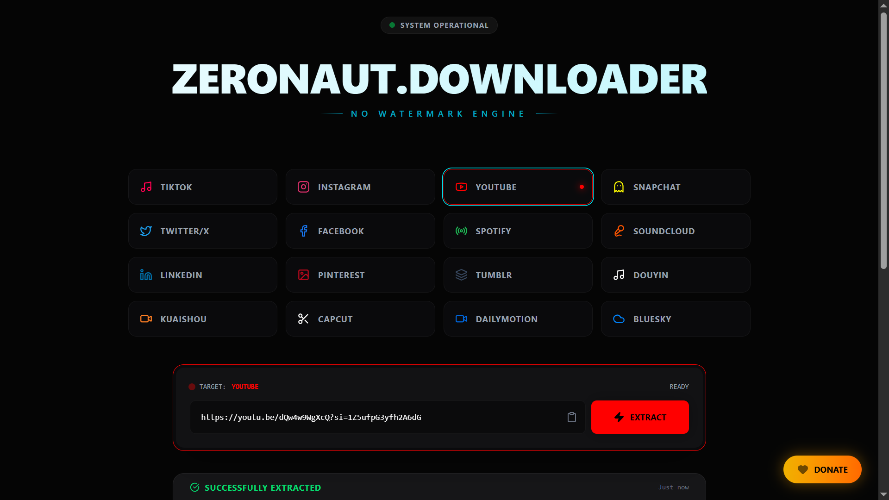
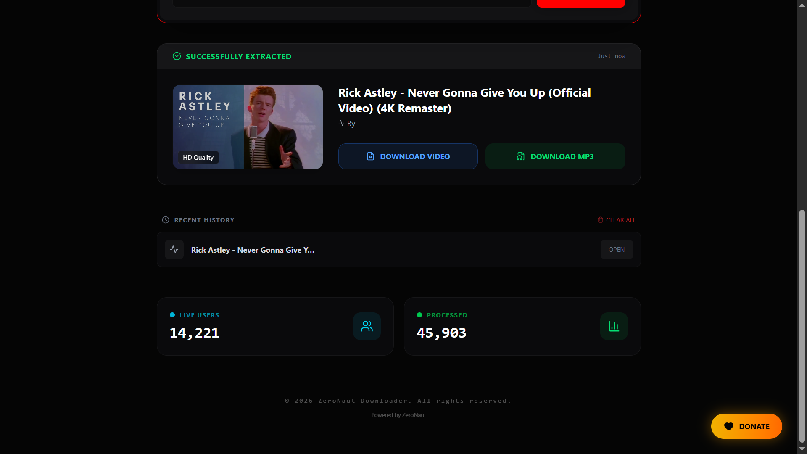

<div align="center">

  <br />
  <h1 style="font-size: 3rem; font-weight: 900;">
    ALLCASTO.DOWNLOADER
  </h1>
  
  <h3 style="color: #a5f3fc;">
    MESIN PENGUNDUH MEDIA TANPA WATERMARK // V.6.1
  </h3>

  <p>
    <em>Aplikasi web modern untuk mengunduh video dan gambar dari berbagai platform media sosial tanpa watermark dengan kualitas terbaik.</em>
  </p>

  <br />
  <a href="https://allcasto-downloader.vercel.app/" target="_blank">
  </a>
  <br />
  <br />

  <h2 align="left">Pratinjau Antarmuka</h2>
  
  <br />
  <br />
  
  <br />
  <br />

  <p>
    
    
    
    
    
  </p>

</div>

<hr />

## Pendahuluan

**Allcasto Downloader** adalah aplikasi Full-Stack yang dirancang untuk mempermudah proses pengunduhan konten media dari berbagai platform sosial. Dengan estetika desain **Futuristik/Cyberpunk**, aplikasi ini memberikan pengalaman pengguna yang mulus baik di perangkat Desktop maupun HP.

Berbeda dengan downloader lainnya, Allcasto fokus pada ekstraksi media **Tanpa Watermark** dan output berkualitas tinggi (HD), menggunakan backend yang dioptimalkan untuk melewati batasan CORS dan API.

## Fitur Utama

- **Dukungan Multi-Platform:** Download dari Instagram (Reels/Post), Facebook, TikTok, YouTube, Pinterest, Spotify, dan banyak lagi.
- **Tanpa Watermark:** Mengambil versi bersih dari video tanpa logo platform.
- **UI Futuristik:** Efek Glassmorphism, gradien neon, dan animasi halus menggunakan Framer Motion.
- **Responsif Penuh:** Tampilan adaptif yang bekerja sempurna di ponsel maupun komputer.
- **Penanganan Error Pintar:** Sistem yang memberi tahu pengguna jika link tidak valid atau akun bersifat privat.
- **Siap Vercel:** Struktur folder yang dioptimalkan untuk deployment serverless di Vercel.

## Teknologi yang Digunakan

### Frontend
- **Framework:** React.js (Vite)
- **Styling:** Tailwind CSS
- **Animasi:** Framer Motion
- **Ikon:** Lucide React
- **HTTP Client:** Axios

### Backend
- **Runtime:** Node.js
- **Server:** Express.js
- **API:** Integrasi Scraper Kustom & API Gimita
- **Deployment:** Vercel Serverless Functions

---

## Memulai (Local Setup)

Ikuti langkah-langkah ini untuk menjalankan project di komputer Anda.

### Instalasi

1. **Clone repositori**
   git clone https://github.com/rezaaplvv/Allcasto-Downloader.git
   cd allcasto-downloader

2. **Instal Dependensi**
   npm install

3. **Jalankan Server Pengembangan**
   Buka dua terminal terpisah:
   
   Terminal 1 (Frontend):
   npm run dev
   
   Terminal 2 (Backend):
   node server/index.js

4. **Akses Aplikasi**
   Buka browser dan buka alamat http://localhost:5173.

---

## Struktur Proyek

allcasto-downloader/
├── api/                # Titik masuk Vercel Serverless
│   └── index.js
├── server/             # Logika Backend
│   ├── services/       # Logika spesifik platform (IG, FB, dll)
│   └── index.js        # Konfigurasi Express
├── src/                # Logika Frontend
│   ├── App.jsx         # UI Utama
│   └── index.css       # Direktif Tailwind
├── vercel.json         # Konfigurasi Deployment Vercel
├── package.json        # Daftar dependensi
└── README.md           # Dokumentasi ini

---

## Deployment (Vercel)

Proyek ini sudah dikonfigurasi untuk **Vercel**.

1. Buat proyek baru di Vercel.
2. Hubungkan ke repositori GitHub ini.
3. Pastikan file `vercel.json` ada di folder utama.
4. Klik **Deploy**.

---

<div align="center">
  <p>
    Dibuat oleh <strong>rezaaplvv</strong>
  </p>
</div>

---

## Allcasto v7 patch notes

This build keeps the original UI and modernizes the extraction layer:

- YouTube: Vidssave primary provider + Vidfly fallback.
- TikTok: SSSTik primary provider + TikDownloader fallback.
- Facebook/Instagram: `metadownloader` primary provider + Gimita fallback.
- Unified backend response (`medias[]`) so provider response changes do not require UI rewrites.
- Generic response normalizer for the other existing platform services.
- `/api/health` diagnostics endpoint.
- Vite local proxy (`/api` -> `http://localhost:3000`) for local development.
- Better URL validation and extraction error details.

### Local run

Use two terminals:

```bash
npm install
node server/index.js
```

and:

```bash
npm run dev
```

The Vite frontend will forward `/api/*` calls to the local Express server.

> Downloader providers are third-party services and can change over time. The fallback/normalizer layer reduces breakage, but cannot guarantee every public URL will always be downloadable. Only download media you are allowed to save.
